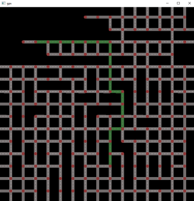
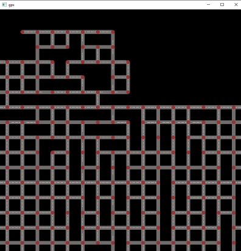
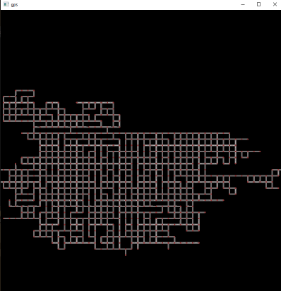

### Description:
- My second solo project, developed in C++ using the SFML library.
- Since my first project, I’ve learned a lot and worked to apply those lessons here.
- I intentionally chose to use raw pointers in order to deepen my understanding of low-level memory management and all the challenges that come with it.

### Goal:
- Build a graph-based simulation of a city.
- Implement functionality to find the shortest route between two selected points.

### Screenshots:
  

    
    
    
  

